# Distribución de vacunados contra COVID-19 en Perú

## Antecedentes

Con la llegada del primer lote de vacunas contra la COVID-19 al país, se inició la [Campaña Nacional de Vacunación, Pongo el hombro por el Perú](https://www.gob.pe/institucion/minsa/campa%C3%B1as/3451-campana-nacional-de-vacunacion-contra-la-covid-19 "Gobierno del Perú"), con el fin de proteger a la población y disminuir el riesgo de enfermar o fallecer.

## Métodos

### Fuentes de Datos

Obtuve las cifras de vacunados de COVID-19, estratificadas por grupo de edad y sexo, de la Plataforma Nacional de Datos Abiertos del Gobierno de Perú. Los conjuntos de datos utilizados están disponibles en el repositorio Vacunación contra COVID-19 del Ministerio de Salud [[1]].

### Visualización de Datos

Este proyecto de visualización de datos se desarrollo en Python 3.8.5 usando los paquetes **numpy**, **pandas**, **matplotlib**, **seaborn**, **datetime** y **os**. Todos los datos usados en esta visualización de datos estan disponibles públicamente [[1]].

## Resultados

### AMAZONAS
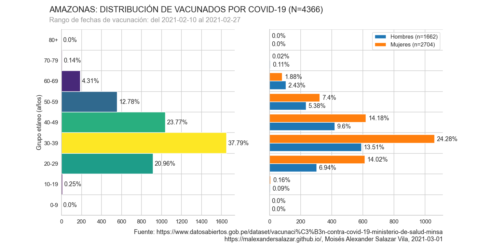
### ANCASH
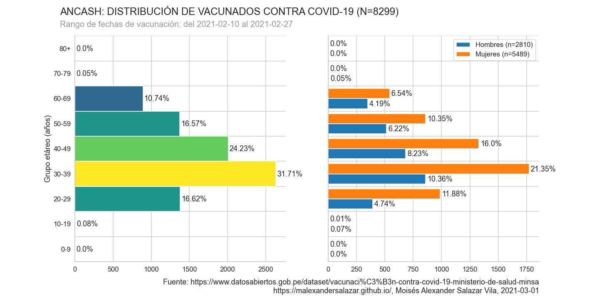
### APURIMAC
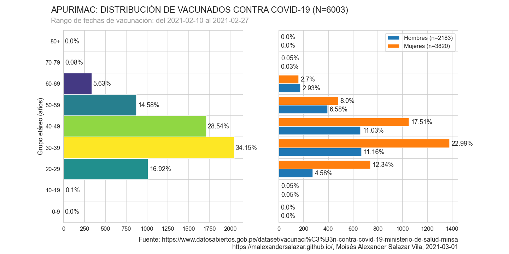
### AREQUIPA
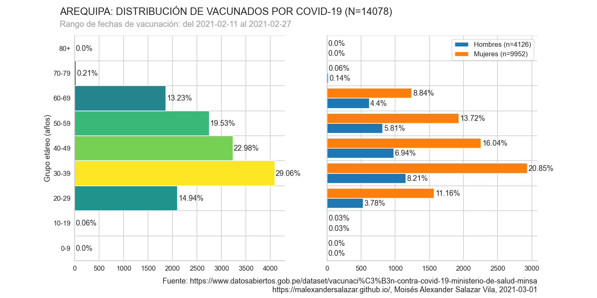
### AYACUCHO
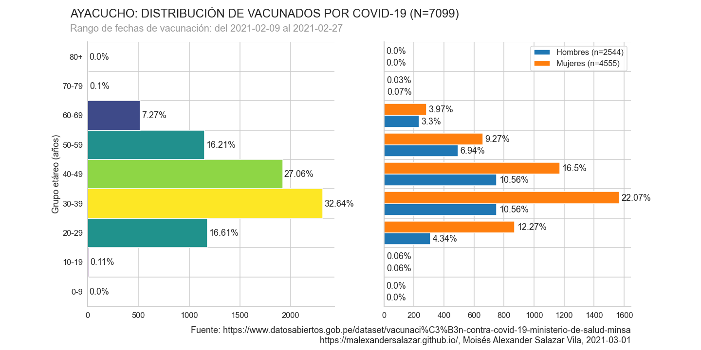
### CAJAMARCA

### CALLAO

### CUSCO

### HUANCAVELICA

### HUANUCO
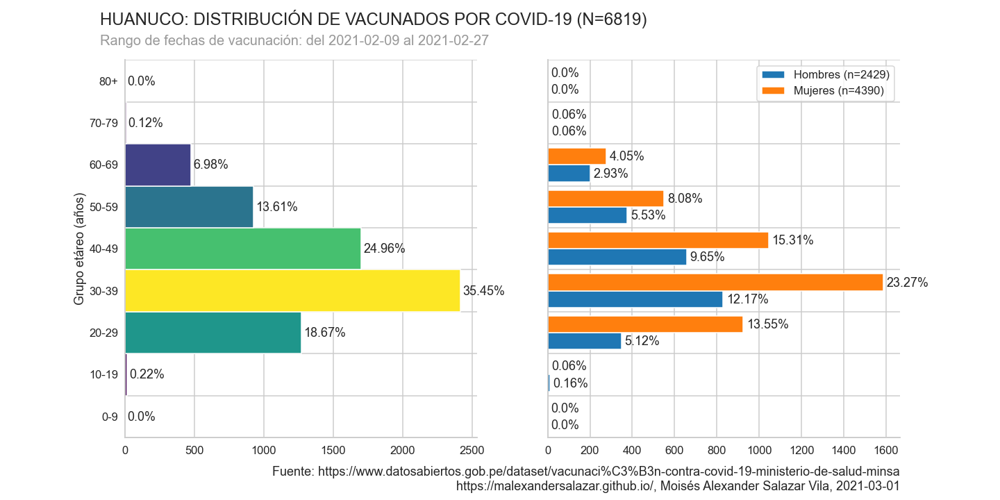
### ICA
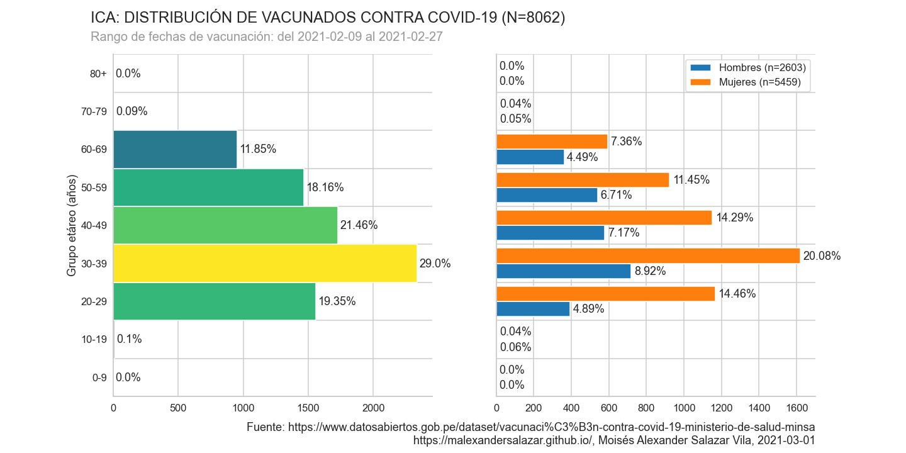
### JUNIN
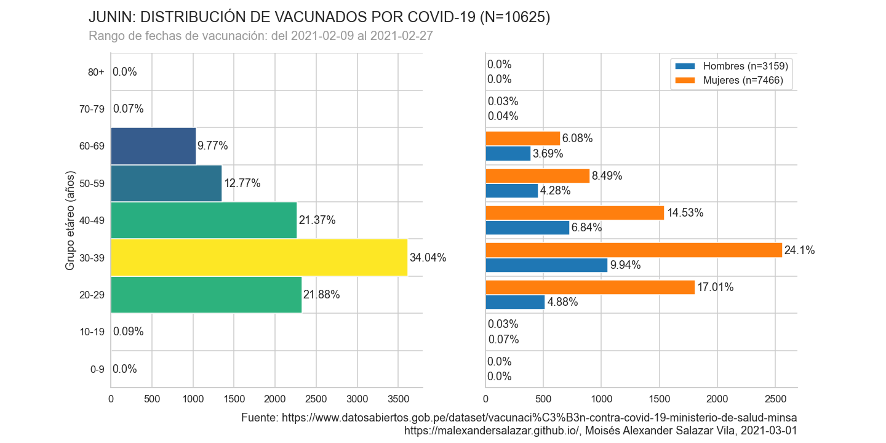
### LA LIBERTAD
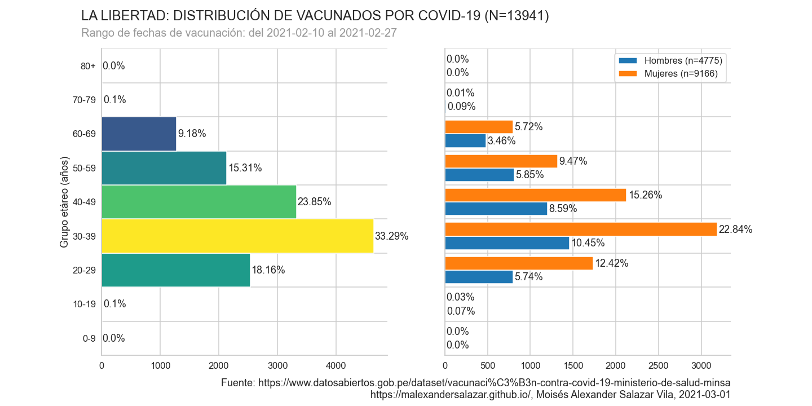
### LAMBAYEQUE
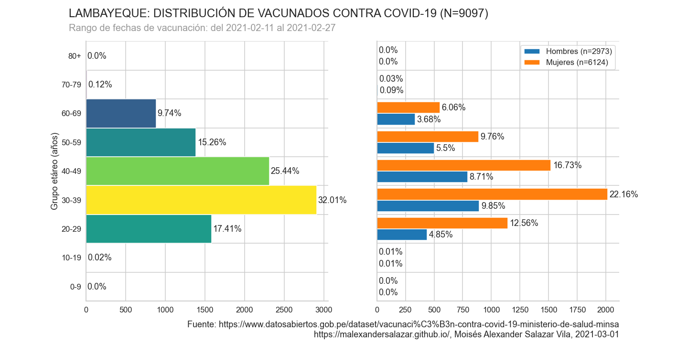
### LIMA
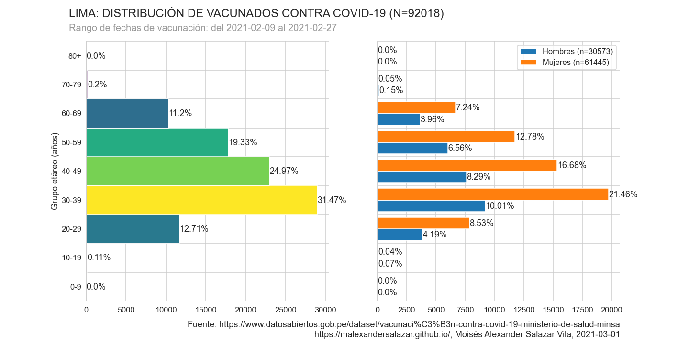
### LORETO
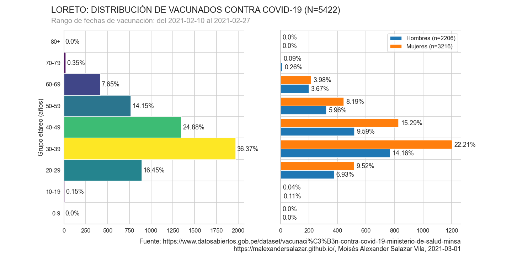
### MADRE DE DIOS

### MOQUEGUA
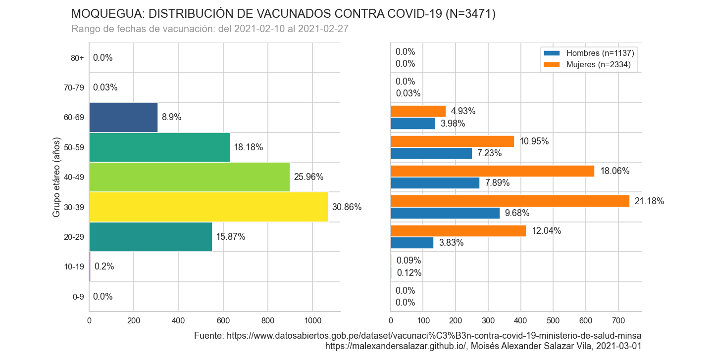
### PASCO
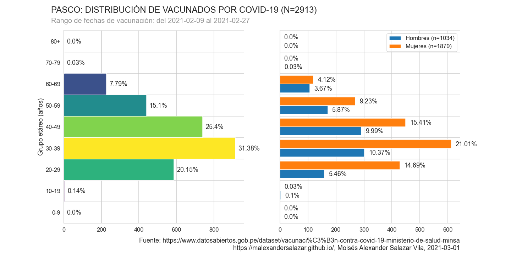
### PIURA
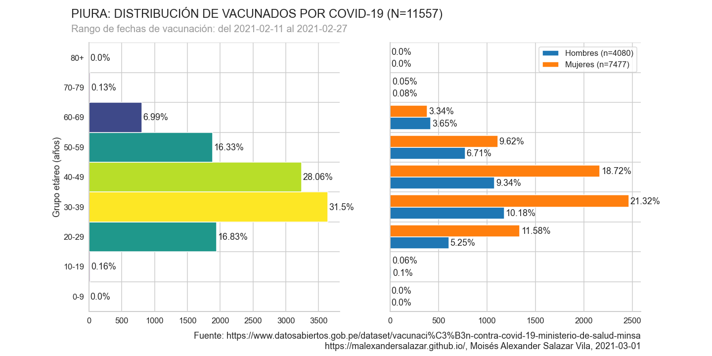
### PUNO
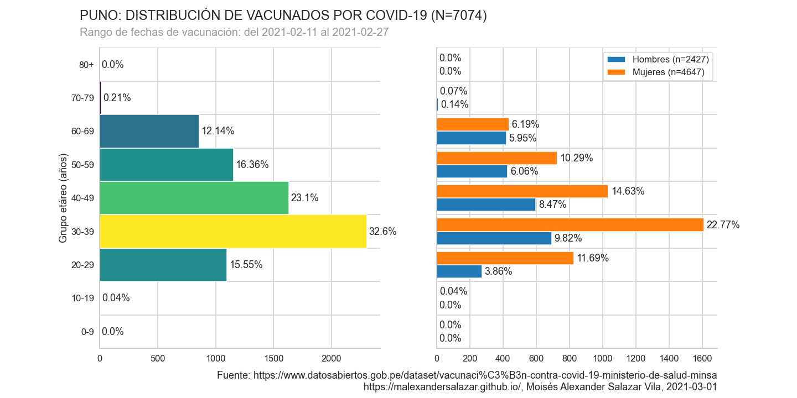
### SAN MARTIN
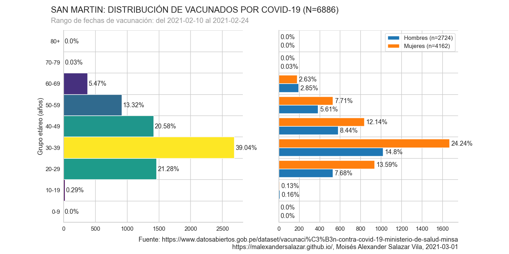
### TACNA
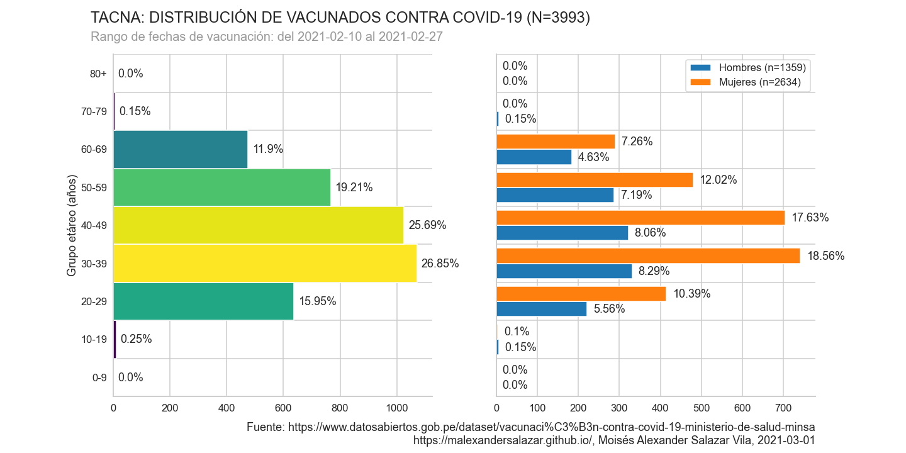
### TUMBES
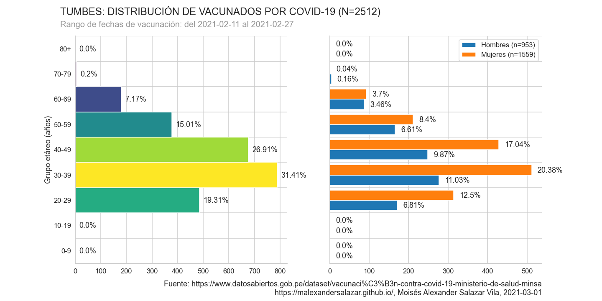
### UCAYALI
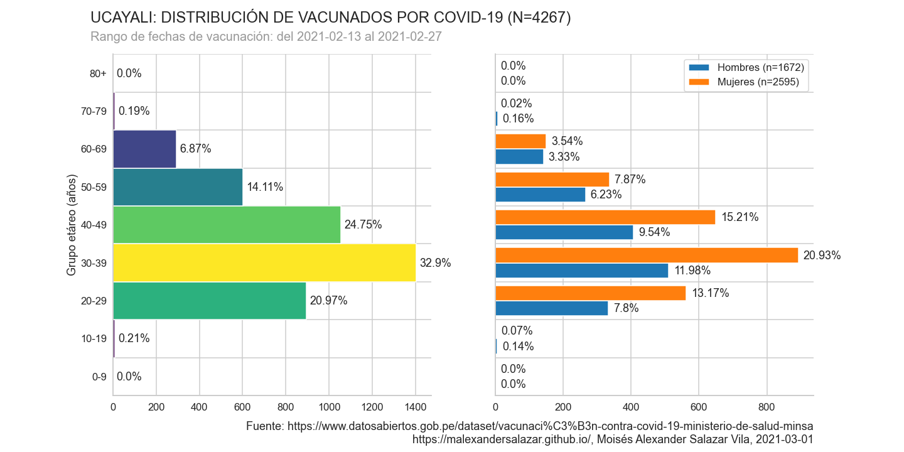

## Disponibilidad de datos y materiales 

Los conjuntos de datos utilizados en el presente proyecto están disponibles en el repositorio [Vacunación contra COVID-19](https://www.datosabiertos.gob.pe/dataset/vacunaci%C3%B3n-contra-covid-19-ministerio-de-salud-minsa "[Ministerio de Salud - MINSA] | Plataforma Nacional de Datos Abiertos")

## Referencias

1. Ministerio de Salud - MINSA. (s.f.). _[Vacunación contra COVID - 19 - [Ministerio de Salud - MINSA] | Plataforma Nacional de Datos Abiertos_. Gobierno del Perú. Recuperado el 1 de marzo de 2021 de https://www.datosabiertos.gob.pe/dataset/vacunaci%C3%B3n-contra-covid-19-ministerio-de-salud-minsa

[1]: https://www.datosabiertos.gob.pe/dataset/vacunaci%C3%B3n-contra-covid-19-ministerio-de-salud-minsa

2. Jesus M. Castagnetto. (s.f.). _GitHub - jmcastagnetto/covid-19-peru-distribucion-poblacion-positivos-fallecidos: Gráficos comparativos de distribuciones poblacionales por grupo etáreo, para todo el Perú y por departamento_. Github. Recuperado el 1 de marzo de 2021 de https://github.com/jmcastagnetto/covid-19-peru-distribucion-poblacion-positivos-fallecidos   

